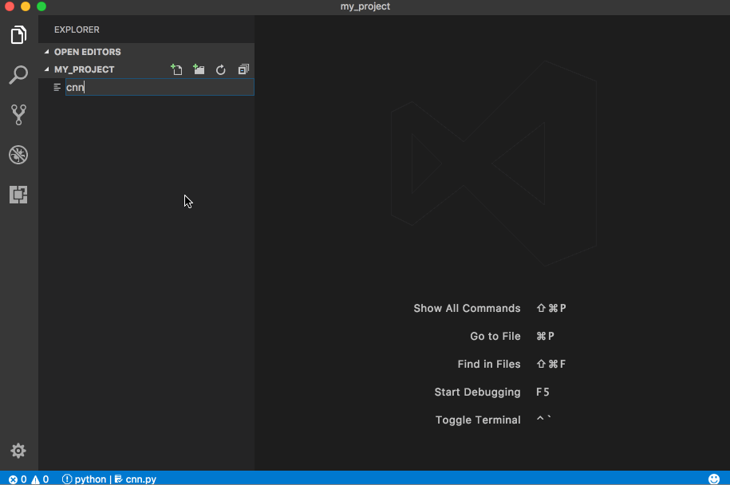

# Visual Studio Code TensorFlow Snippets

This extension includes a set of useful code snippets for developing TensorFlow models in [Visual Studio Code](https://code.visualstudio.com/).

See [Getting started](#get-started) for a quick tutorial on how to use this extension.



## Features

The extension includes two sets of snippets. The first are used to generate a framework for training neural networks:

- `tf:trainer`: Generates an entire training framework based on learn API.
- `tf:cnn-classifier`: Generates a convolutional neural network classifier.
- `tf:mnist`: Generates data loader for mnist dataset.

The second set of commands are short code snippets for common TensorFlow operations:
- `tf:import`: Imports TensorFlow package.
- `tf:conv2d`: Defines a 2D convolution layer.
- `tf:dense`: Defines a dense (fully connected) layer.
- `tf:maxpool2d`: Defines a max pooling layer.
- `tf:dropout`: Defines a dropout layer.
- `tf:cross-entropy`: Defines a softmax cross entropy loss.


## Installation
<a name="installation"></a>

Install Visual Studio Code from [here](https://code.visualstudio.com/).

Install this extension by selecting `Install Extension` in the command pallette (cmd-shift-p) and searching for "TensorFlow Snippets".

The generated code also relies on the following python dependencies:
```bash
pip install numpy
pip install tensorflow  # or tensorflow-gpu
pip install six
```

## Getting started
<a name="get-started"></a>

Make sure the [requirements](#installation) are installed.

Create a new directory for your project.
Create trainer.py, open the file and type: `tf:trainer` enter.
Create cnn.py, open the file and type: `tf:cnn-classifier` enter.
Create mnist.py, open the file and type: `tf:mnist` enter.

Edit trainer.py, and insert two lines at the top:
```python
import cnn
import mnist
```

In the MODELS dictionary, add a new element `"cnn": cnn`, also in the DATASETS dictionary add a new element `"mnist": mnist`. Now run the trainer:
```
python -m trainer --model=cnn --dataset=mnist
```

Open another terminal window in the same directory, and type:
```
tensorboard --logdir=output
```

Point your browser at http://localhost:6006.

## Release Notes

Added CIFAR 10 and CIFAR 100 datasets.
